# github

GitHub integration for Claude Code — slash commands for managing issues and pull requests.

Each command follows a **draft → iterate → confirm → execute** workflow. Nothing is posted or applied until you explicitly confirm.

## Installation

```
/plugin install github@claude-skills
```

## Requirements

- [`gh` CLI](https://cli.github.com/) installed and authenticated (`gh auth status`)
- Write permissions on the target repository

## Workflow

The commands form a spec-driven development pipeline. The main flow moves top-to-bottom from issue creation through code review, with supporting commands available at each stage.

<picture>
  
</picture>

**Main pipeline:**

1. **`/gh-issue-create`** — open a GitHub issue describing the work
2. **`/gh-issue-plan`** — draft a high-level implementation plan, posted as an issue comment. Iterate with human feedback until the plan is approved.
3. **`/gh-issue-develop`** — promote the approved plan into an execution-ready plan, create a feature branch, commit the plan to `.github/claude/plans/`, and open a draft PR
4. **Implementation** — engineer and/or agent implement the tasks from the plan
5. **`/gh-pr-create`** — generate a diff-driven PR description and mark the PR ready for review
6. **`/gh-pr-review`** — structured code review with severity-classified findings

**Supporting commands** can be used at any point during the pipeline:

- **`/gh-issue-edit`**, **`/gh-issue-comment`** — refine issues during planning
- **`/gh-pr-edit`**, **`/gh-pr-comment`** — update PRs during review

Each step is optional — you can enter the pipeline at any point. For example, use `/gh-pr-review` on any existing PR without going through the full flow.

## Commands

### `/gh-issue-create`

Draft and create a new GitHub issue with a structured title and body.

```
/gh-issue-create login page returns 500 error on expired sessions
/gh-issue-create add dark mode support to settings page --label enhancement
/gh-issue-create label:bug,urgent search results are empty for non-ASCII queries
```

The entire argument is the issue description. Supports `--label label1,label2` (or `label:name` prefixes) and `--assignee username` flags. If the repo has `.github/ISSUE_TEMPLATE/` templates, the best match is auto-detected and offered. The body is structured by issue type (bug, feature, general) with appropriate sections (Steps to Reproduce, Acceptance Criteria, etc.).

---

### `/gh-issue-comment`

Draft and post a comment on a GitHub issue.

```
/gh-issue-comment 42 thank the reporter and ask for a reproduction case
/gh-issue-comment 42 summarize the discussion so far
/gh-issue-comment 42
```

The first argument is the issue number. The rest is the comment intent. If no intent is given, the command infers a helpful comment from issue context. Validates for tone and quality, shows you a draft, and posts only after you confirm.

---

### `/gh-issue-edit`

Edit the title and/or body of a GitHub issue.

```
/gh-issue-edit 42 add a definition of done section
/gh-issue-edit 42 shorten the title and add reproduction steps
/gh-issue-edit 42 rewrite the description as a bug report
```

The first argument is the issue number. Only the requested changes are applied — existing wording and structure are preserved unless explicitly changed. Titles are kept under 72 characters.

---

### `/gh-issue-plan`

Draft a high-level implementation plan for a GitHub issue and post it as a comment.

```
/gh-issue-plan 42
/gh-issue-plan 42 focus on the database migration
/gh-issue-plan 42 focus on the auth module
```

The first argument is the issue number. Optional second argument scopes the plan to a focus area. The plan is a **human-readable design document** meant for review and iteration — it describes *what* and *why*, not exact code. Includes: goal, approach, affected areas, 3-8 tasks with estimates (XS/S/M/L), dependencies, and open questions. Idempotent: if a plan comment already exists (identified by a tracking marker), it updates rather than duplicates. When the plan is ready, run `/gh-issue-develop N` to promote it to execution.

---

### `/gh-issue-develop`

Promote a draft plan into an execution-ready plan, create a feature branch, and open a draft PR.

```
/gh-issue-develop 42
/gh-issue-develop 42 --base develop
```

The first argument is the issue number. Requires a draft plan posted by `/gh-issue-plan` on the issue. Expands the high-level plan into an execution-ready format (with file paths, acceptance criteria, test strategy, and commit messages per task), creates a branch (`42/slugified-title`), saves the plan to `.github/claude/plans/`, commits it, and opens a draft PR linking to the issue. Supports `--base` to branch from a non-default branch.

---

### `/gh-pr-create`

Draft and create a new GitHub pull request from the current branch.

```
/gh-pr-create
/gh-pr-create add dark mode support to the settings page
/gh-pr-create --draft --label enhancement --reviewer octocat
/gh-pr-create fixes #42 --base develop
```

The title and body are generated from the branch's diff and commits. An optional description argument refines the output. Supports `--draft`, `--base`, `--label`, `--reviewer`, and `--assignee` flags. If the repo has a `.github/PULL_REQUEST_TEMPLATE.md`, the template structure is used. The body follows a Summary, Changes, Risk Level, Testing, Impact structure (sections omitted when not relevant).

---

### `/gh-pr-comment`

Draft and post a comment on a GitHub pull request.

```
/gh-pr-comment 99 ask the author to add tests for the edge cases
/gh-pr-comment 99 summarize the changes in this PR
/gh-pr-comment 99
```

The first argument is the PR number. Aware of PR state (draft/open/merged), review decision, and recent activity. Detects redundancy and warns before posting similar content to existing comments.

---

### `/gh-pr-edit`

Edit the title and/or body of a GitHub pull request.

```
/gh-pr-edit 99 add a testing section and update the summary
/gh-pr-edit 99 shorten the title
/gh-pr-edit 99 rewrite the description to include risk level
```

The first argument is the PR number. Warns if the PR has approved reviews (edits may affect reviewer confidence). Only requested changes are applied.

---

### `/gh-pr-review`

Draft and submit a structured code review for a GitHub pull request.

```
/gh-pr-review 99
/gh-pr-review 99 approve
/gh-pr-review 99 request-changes
/gh-pr-review 99 comment focus on error handling
/gh-pr-review 99 approve focus on the auth changes
```

The first argument is the PR number. Optional second argument is the outcome (`approve`, `request-changes`, or `comment`). Optional remaining text is a focus area. Analyzes the diff and organizes findings by severity: **High** (blocks approval), **Medium** (logic/edge cases), **Low** (minor improvements). If no outcome is specified, it is determined from the findings. Checks for a prior AI-generated review on the same commit before submitting to prevent duplicates.

---

## Environment Variables

| Variable | Used by |
|----------|---------|
| `CLAUDE_SESSION_ID` | All commands — session ID used to derive the session state directory (`${HOME}/.local/state/gh/claude/sessions/${CLAUDE_SESSION_ID}`) |
| `CLAUDE_PLUGIN_ROOT` | All commands — path to jq query files bundled with this plugin |

`CLAUDE_SESSION_ID` is set automatically by Claude Code. When using commands standalone, set it manually:

```bash
export CLAUDE_SESSION_ID=my-session-id
```
